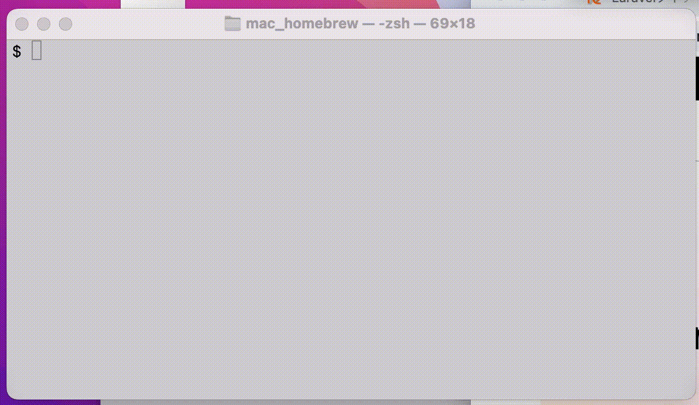

# 説明用の動画をMarkdownに含める

こんな感じで説明用の動画があるとわかりやすいかも。

## 主な手順
1. 動画を準備 (mp4)
2. 動画(mp4)をgitファイルに変換
3. Markdownに埋め込む

スクリーンを録画する動画編集ソフトは無料のツール、有料のツールがたくさんあるので自分にあったものを探してみる。

## 利用したツール

動画の作成に [wondershare democreator](https://dc.wondershare.jp/?gclid=CjwKCAjw5s6WBhA4EiwACGncZSEIImNOXfLpbZqr_YrYzBSAr9p2ArTIyfWOtf2oGF39Kz7SaX_ekhoCpTQQAvD_BwE) を利用し、

mp4からgifへの変換は [convertio.co](https://convertio.co/ja/mp4-gif/) を利用しました。

